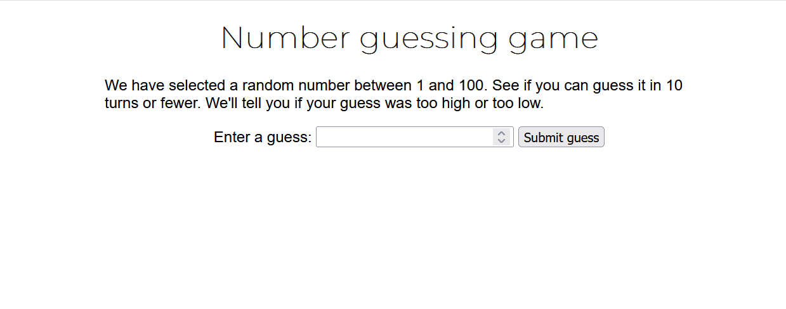

# Number Guessing Game 🍀

 This is a simple game where you try to guess a number between 1 and 100. See if you can guess it in 10 turns or fewer. We'll tell you if your guess was too high or too low. You can also submit your guess by pressing the Enter key. Good luck!

## Features

- The game randomly generates a number between 1 and 100.
- You have up to 10 attempts to guess the correct number.
- You can also submit your guess by pressing the Enter key.
- After each guess, the game provides hints if the number is too high, too low, or if you've guessed correctly.
- When the game ends, you can restart and try again.

## Overview 

